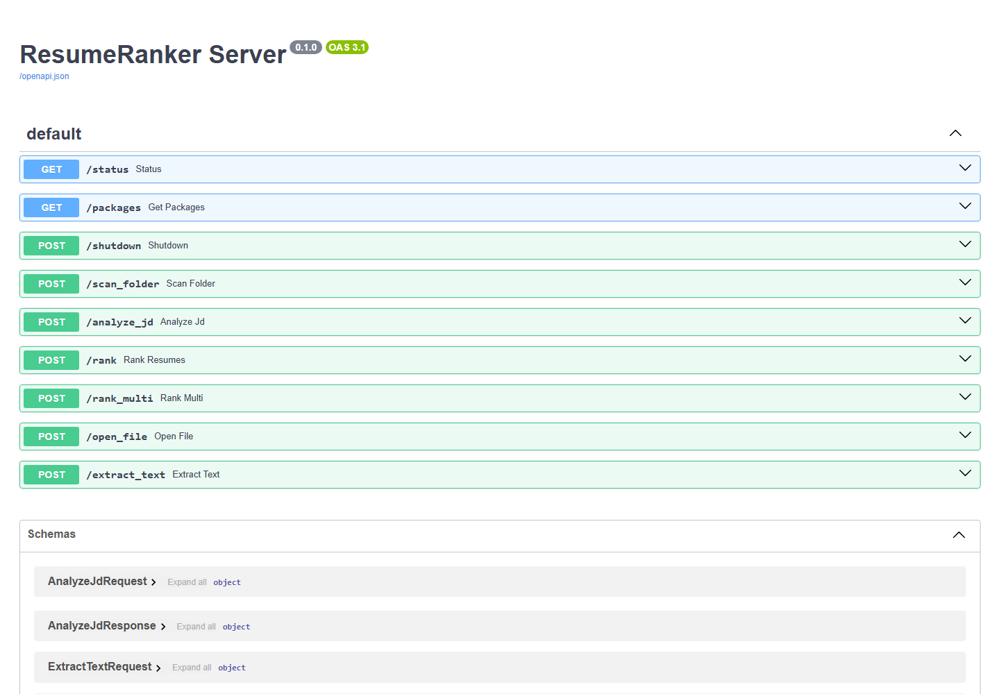
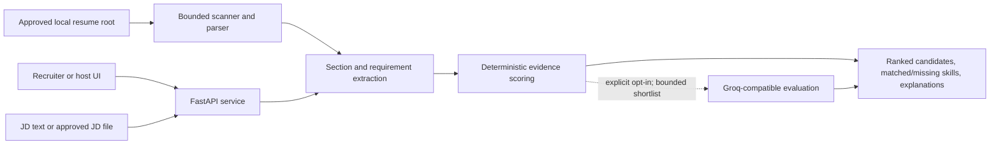

# ResumeRanker

### Turn a resume folder and a job description into an evidence-led shortlist that a human can actually review.

An AI product-builder portfolio project by [Karthik Ramesh](https://github.com/KarthikRamesh9149), designed around transparent matching rather than opaque automated hiring decisions.



*The standalone API surface running locally. `ResumeRankerWindow.tsx` is a UI component for its host workflow, not a packaged standalone frontend.*

## What it is

ResumeRanker is a local-first resume-screening service for PDF, DOCX, and TXT documents. It reads an approved folder, extracts requirements from a job description, ranks candidate evidence, and returns matched and missing skills, section scores, and concise explanations.

Every candidate starts with deterministic local scoring. A Groq-compatible model can be opted into for a bounded shortlist, but it is not required for the ranking workflow.

## Who it serves—and the problem it solves

ResumeRanker is for recruiters, hiring managers, talent operations teams, and forward-deployed engineers building a tightly scoped internal review workflow.

Keyword-only filtering is hard to defend: it loses the difference between a technology listed in a skills section and the same technology demonstrated in a project or role. ResumeRanker makes that evidence visible, keeps documents on an approved local path by default, and returns a shortlist meant to support—not replace—human judgment.

## Product workflow

1. **Set a review boundary** — configure one approved local workspace containing the candidate documents and, if needed, a job-description file.
2. **Inspect the candidate set** — scan supported PDF, DOCX, and TXT files under that root.
3. **Understand the role** — paste a job description or analyse an approved JD file to extract required and preferred skills, experience expectations, certifications, and multiple roles where detected.
4. **Rank the evidence** — score projects, experience, skills, certifications, and TF-IDF similarity; return the strongest candidates with matched and missing requirements.
5. **Compare roles** — rank the same resume folder against a bounded list of job descriptions without rereading documents for each role.
6. **Review, decide, document** — use the ranking and explanations as decision support; a human remains responsible for every hiring decision.

## Key features

| Capability | Value to the reviewer |
| --- | --- |
| Approved-root file access | Keeps scanning and text extraction inside one configured workspace; path traversal, symlink, and sibling-prefix escapes are rejected. |
| PDF, DOCX, and TXT parsing | Lets teams work with common local resume and JD formats without a separate conversion step. |
| Requirement extraction | Separates required skills, preferred skills, experience, and certifications; can detect multiple roles in one JD. |
| Evidence-weighted ranking | Scores project, experience, skills, and certification sections separately, so demonstrated work can carry more weight than a keyword list. |
| Transparent review output | Returns section scores, matched and missing skills, TF-IDF similarity, keyword coverage, and a deterministic explanation for each ranked candidate. |
| Multi-role evaluation | Reuses resume text to rank one candidate folder against multiple job descriptions, subject to configured limits. |
| Optional bounded AI review | With explicit local configuration and request opt-in, applies a Groq-compatible model only to a limited shortlist. |

## Architecture



`resumeranker_server.py` owns the API boundary, document parsers, extraction logic, ranking, and optional provider integration. `ResumeRankerWindow.tsx` is a host-workflow UI component rather than a separately runnable web app.

## Tech stack

| Layer | Implementation |
| --- | --- |
| Service API | FastAPI + Uvicorn |
| Resume/JD parsing | PyMuPDF + python-docx + standard text reading |
| Matching | scikit-learn TF-IDF and cosine similarity |
| Scoring support | NumPy + SciPy + Joblib |
| Configuration | python-dotenv |
| Optional AI evaluation | Groq-compatible OpenAI-style API via Requests |
| Host UI component | TypeScript / React (`ResumeRankerWindow.tsx`) |
| Quality gates | pytest + GitHub Actions |

## Quick start

**Prerequisite:** Python 3.12 or 3.13.

```bash
git clone https://github.com/KarthikRamesh9149/ResumeRanker.git
cd ResumeRanker
python -m venv .venv
source .venv/bin/activate
python -m pip install -r requirements.txt -r requirements-dev.txt
cp .env.example .env
```

Create a dedicated local review workspace, then make it the only root the service may read:

```bash
export RESUMERANKER_APPROVED_ROOT=/absolute/path/to/review-workspace
RESUMERANKER_MODE=demo python resumeranker_server.py
```

The demo mode is local-only and intentionally unauthenticated. For a protected local service instead:

```bash
export RESUMERANKER_APPROVED_ROOT=/absolute/path/to/review-workspace
export RESUMERANKER_API_TOKEN='replace-with-a-random-32-plus-character-secret'
python resumeranker_server.py
curl http://127.0.0.1:8892/packages \
  -H "Authorization: Bearer $RESUMERANKER_API_TOKEN"
```

`GET /status` is public for readiness. The authenticated review flow is: `/scan_folder` → `/analyze_jd` → `/rank` or `/rank_multi`; `/extract_text` and `/open_file` support review of approved documents.

## Product and engineering decisions

- **Evidence before an LLM.** All resumes receive deterministic section-based scoring first. The optional provider only evaluates a bounded top subset when a request and local configuration explicitly allow it.
- **Demonstrated work matters.** The ranking model distinguishes evidence in projects, experience, skills, and certifications instead of treating a flat keyword list as a complete signal.
- **No silent penalty for irrelevant signals.** When a JD does not ask for certifications, or relevant experience evidence is absent, the scoring weights are redistributed rather than quietly penalising the candidate.
- **Local data boundaries are part of the product.** File features remain disabled until `RESUMERANKER_APPROVED_ROOT` is configured, and all paths are resolved inside that canonical root.
- **Human review is the final control.** Outputs are decision support. The service does not make hiring decisions, validate fairness, or provide a complete hiring-governance workflow.

## Testing

```bash
python -m py_compile resumeranker_server.py
python -m pytest -q
```

GitHub Actions installs the declared dependencies and runs the test suite on Python 3.12 and 3.13.

## Security and limitations

- The service binds to loopback unless `RESUMERANKER_ALLOW_NETWORK_EXPOSURE=true` is set. Production mode requires a 32+ character `RESUMERANKER_API_TOKEN`; wildcard Host and CORS values fail configuration validation.
- The approved root, per-file size, aggregate folder size, scan count, request body, job-description count, and AI shortlist size are bounded. Defaults are documented in [`.env.example`](.env.example) and hard limits are enforced by the service.
- Resume and JD content stays local unless all three conditions are met: the request opts in, `RESUMERANKER_ENABLE_LLM_CALLS=true`, and `GROQ_API_KEY_1` is configured. Obtain the appropriate consent and review provider terms first.
- This repository does **not** provide OCR, malware scanning, document sandboxing, tenant isolation, subject-level audit logs, TLS termination, anti-bias validation, durable job queues, or a complete hiring-governance system. Network deployments need TLS, rate limiting, an identity-aware proxy, and least-privilege access to a dedicated document root.

## License

All rights reserved. See [LICENSE](LICENSE).
